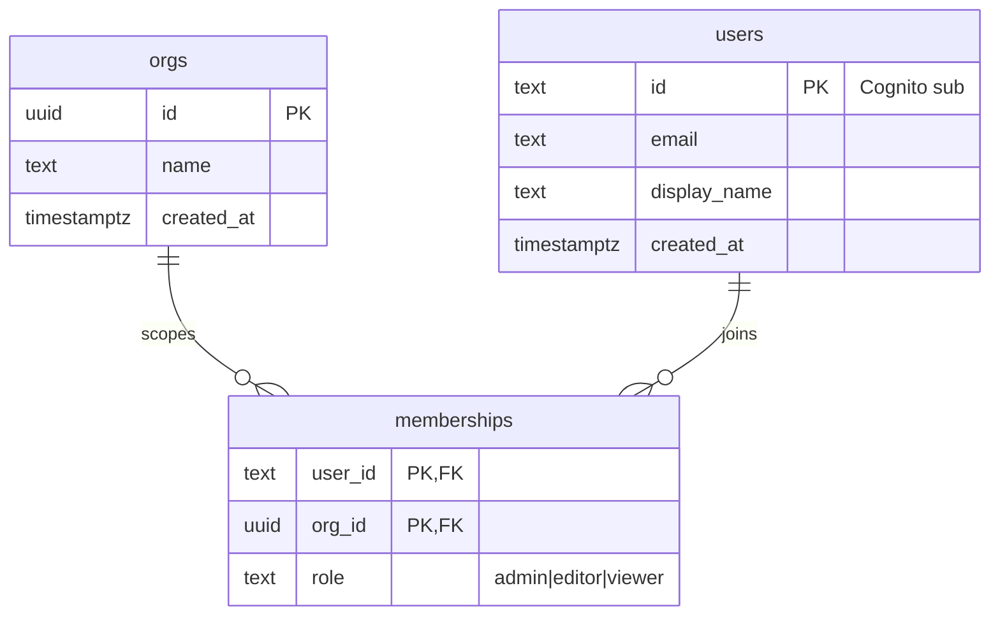
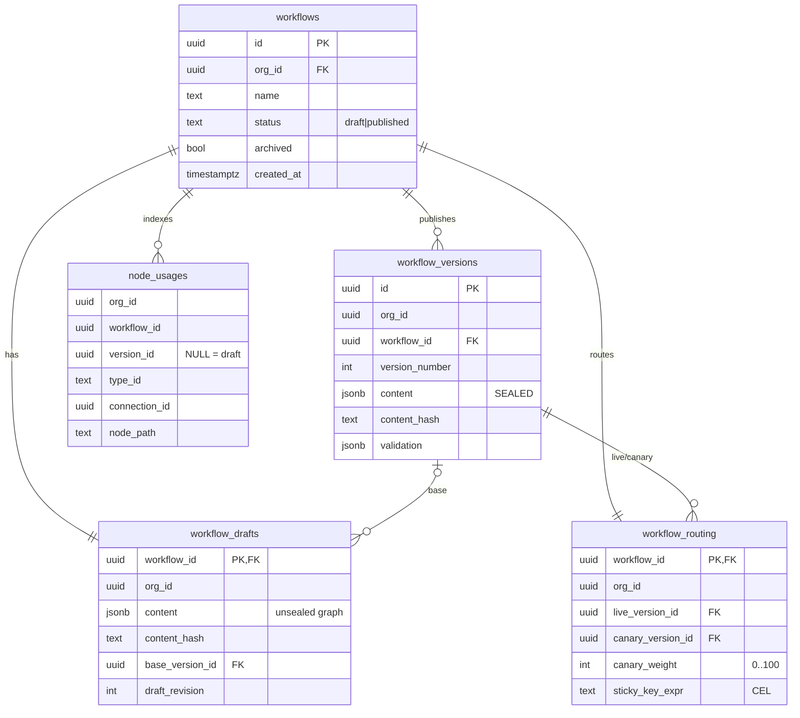
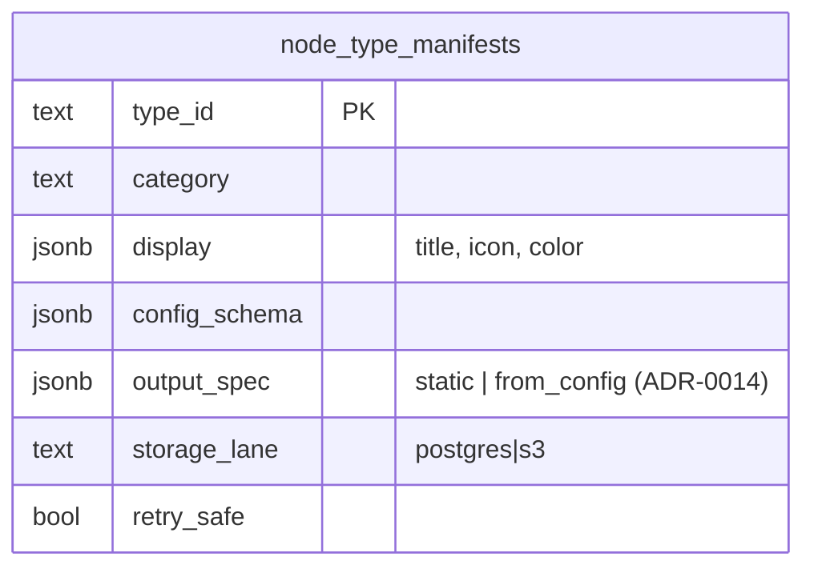
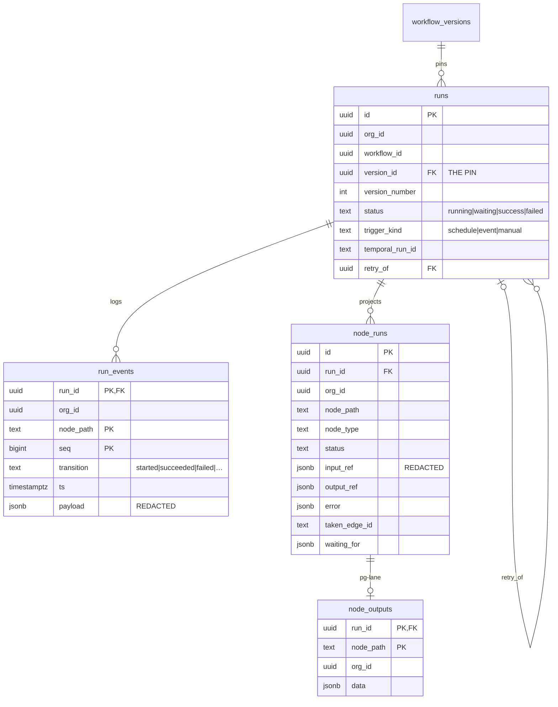
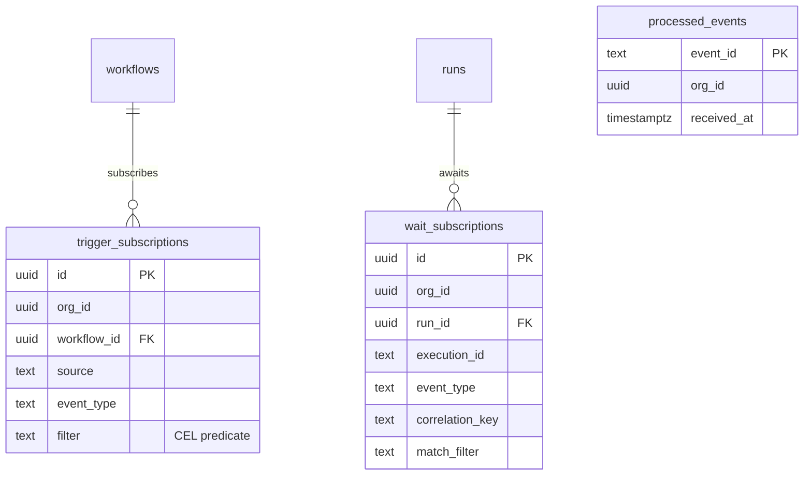
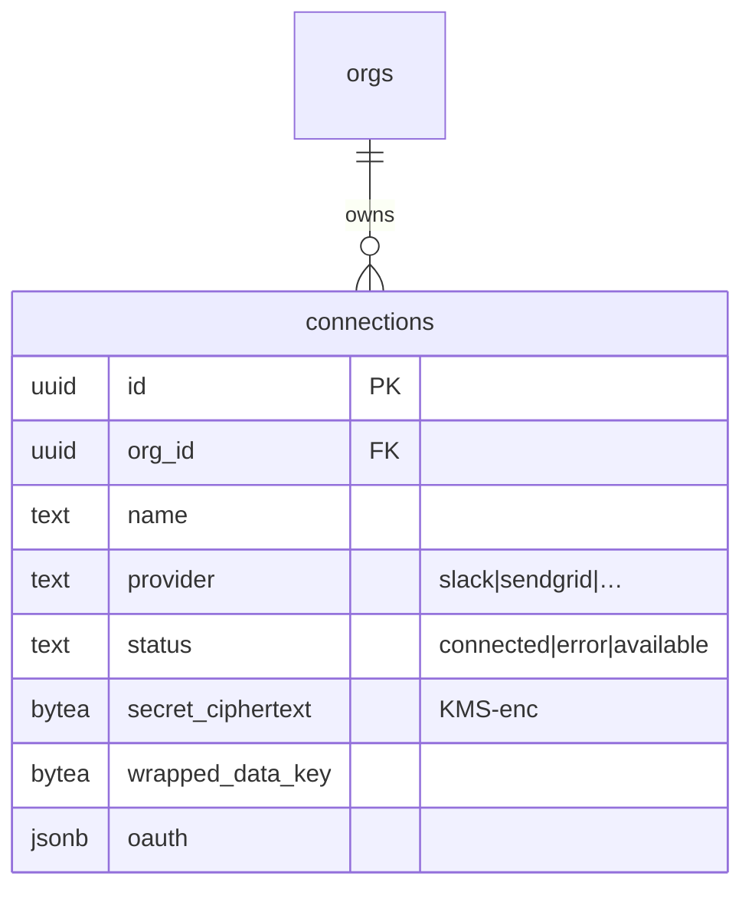

# FM Flow — Persistence Data Model (LLD)

Consolidates the storage implied across [ADR-0001…0011](../adr/README.md) into one coherent Postgres schema. Status: design draft, 2026-06-16. DDL is illustrative (types/constraints indicative, not final).

## Conventions

- **Tenant isolation (ADR-0011):** every *tenant* table carries `org_id` and is governed by **Postgres RLS** — the `org_id` is set as a session variable per request/activity, and policies fail closed. `org_id` is **denormalized onto child tables** (e.g. `node_runs`, `wait_subscriptions`) so RLS is a single-column predicate, not a join.
- **Global tables** (node-type registry) are **not** org-scoped — no `org_id`, no RLS.
- **Graph content** (nodes, edges, trigger config, per-node config incl. CEL expressions, layout) is stored as a single **JSONB `content`** document on drafts/versions. It references node types by `type_id` (ADR-0009) and connections by `connection_id` (ADR-0008) — never inline secrets.
- **Output refs** point at either Postgres (small) or S3 (large) per the node type's static storage lane (ADR-0002).
- Timestamps `*_at` are `timestamptz`. PKs are `uuid` unless noted.

## Entity relationships

```
orgs ─┬─< memberships >─ users(cognito sub)
      ├─< connections (enc)
      └─< workflows ─┬─ 1:1 draft
                     ├─ 1:1 routing ──► live_version, canary_version
                     ├─< versions (immutable)
                     ├─< trigger_subscriptions
                     └─< runs ──► version (PIN) ─┬─< node_runs ──< node_outputs(pg) | S3
                                                 ├─ retry_of ► runs
                                                 └─< wait_subscriptions   (v1-deferred)

node_type_manifests   (GLOBAL, latest-only)        processed_events (dedup ledger)
Temporal Schedules    (external; reconciled from workflows' scheduled trigger config)
```

## Tables

### Identity & tenancy (ADR-0011)



```sql
orgs (id, name, created_at)

users (                      -- cached profile; identity of record is Cognito
  id            text PK,     -- Cognito `sub`
  email         text,
  display_name  text,
  created_at )

memberships (               -- authz source of truth; multi-org
  user_id   text REF users(id),
  org_id    uuid REF orgs(id),
  role      text CHECK (role IN ('admin','editor','viewer')),
  PRIMARY KEY (user_id, org_id) )
-- RLS: rows visible where org_id ∈ caller's validated memberships.
```

### Workflows, drafts, versions, routing (ADR-0001, 0007)



```sql
workflows (
  id, org_id, name,
  status      text CHECK (status IN ('draft','published')),
  archived    bool DEFAULT false,
  created_at, updated_at )

workflow_drafts (           -- single mutable draft per workflow
  workflow_id   uuid PK REF workflows(id),
  org_id        uuid,
  content       jsonb,                 -- the unsealed graph
  content_hash  text,                  -- semantic hash (excl. layout) for dirty-check
  base_version_id uuid NULL REF workflow_versions(id),
  draft_revision  int,                 -- optimistic concurrency token
  updated_by      text, updated_at )

workflow_versions (         -- immutable published snapshots
  id, org_id, workflow_id,
  version_number int,                  -- monotonic per workflow
  content        jsonb,                -- SEALED graph (never mutated)
  content_hash   text,
  note           text NULL,
  validation     jsonb NULL,           -- {wasValid, warnings[]} at publish
  published_by   text, published_at,
  UNIQUE (workflow_id, version_number) )
-- append-only: revoke UPDATE/DELETE (app + DB trigger).

workflow_routing (          -- replaces single current_version (ADR-0007)
  workflow_id      uuid PK REF workflows(id),
  org_id           uuid,
  live_version_id  uuid REF workflow_versions(id),
  canary_version_id uuid NULL REF workflow_versions(id),
  canary_weight    int  DEFAULT 0,     -- 0..100
  sticky_key_expr  text NULL )         -- CEL ref over the event

node_usages (               -- DERIVED index over content (Persistence #35, hybrid)
  org_id, workflow_id, version_id NULL,   -- NULL = the draft
  type_id       text,        -- node-type usages
  connection_id uuid NULL,   -- connection references
  node_path     text )
-- rebuilt from `content` on publish (versions, immutable) / on save (draft).
-- alternative/supplement: a GIN index on the JSONB `content`.
```

### Node-type registry (ADR-0009) — GLOBAL



```sql
node_type_manifests (       -- built-in catalog, latest-only, NOT org-scoped
  type_id        text PK,
  category       text,
  display        jsonb,      -- title, icon, category color
  config_schema  jsonb,      -- replaces FIELD_DEFS
  output_spec    jsonb,      -- static {path,type}[] OR from_config rule (ADR-0014); reference/autocomplete source
  storage_lane   text CHECK (storage_lane IN ('postgres','s3')),  -- ADR-0002
  retry_safe     bool )      -- gates "Retry from here" (ADR-0005)
-- executor (the activity) is code in the worker, keyed by type_id; not a table.
```

### Runs & read-model (ADR-0002, 0004, 0005) — event-sourced

The read-model is **event-sourced** (Persistence #36): `run_events` is the append-only canonical log; `node_runs` and the `runs` rollup are **projections** of it. Each `recordProgress` append simultaneously is the Redis delta, projects current state, and builds the trace timeline.



```sql
run_events (                -- CANONICAL append-only transition log
  run_id REF runs(id), org_id,
  node_path  text,
  seq        bigint,        -- per (run_id,node_path) ordering
  transition text,          -- started|succeeded|failed|cancelled|waiting|resumed|skipped
  ts         timestamptz,
  payload    jsonb,         -- refs/error/timing; secrets REDACTED
  PRIMARY KEY (run_id, node_path, seq) )   -- idempotent recordProgress key
-- time-range partitioned by ts; shortest retention tier (see Partitioning).

runs (                      -- run-level summary (PROJECTION of run_events)
  id, org_id, workflow_id,
  version_id      uuid REF workflow_versions(id),   -- THE PIN (immutable)
  version_number  int,                              -- denormalized
  status          text CHECK (status IN ('running','waiting','success','failed')),
  trigger_kind    text,      -- 'schedule' | 'event' | 'manual'
  temporal_run_id text,      -- link to Temporal execution
  retry_of        uuid NULL REF runs(id),           -- ADR-0005 Case A
  started_at, finished_at, duration_ms )
-- INDEX (workflow_id, started_at DESC)  → history list + dashboard health
-- INDEX (org_id, status)

node_runs (                 -- per-node CURRENT STATE (projection of run_events)
  id, run_id REF runs(id), org_id,
  node_path     text,        -- hierarchical (e.g. map[item=42].sendEmail); v1 flat
  node_type     text,
  status        text CHECK (status IN ('running','waiting','succeeded','failed','cancelled','skipped')),
  input_ref     jsonb,       -- {store:'postgres'|'s3', location}; REDACTED of secrets
  output_ref    jsonb,
  error         jsonb NULL,
  taken_edge_id text NULL,   -- branch path taken
  waiting_for   jsonb NULL,  -- event descriptor when status='waiting'
  started_at, finished_at,
  UNIQUE (run_id, node_path) )   -- projection key (one current-state row per node)

node_outputs (              -- postgres-lane outputs (s3-lane lives in S3, key in *_ref)
  run_id, node_path, org_id,
  data jsonb,
  PRIMARY KEY (run_id, node_path) )
```

### Triggers & events (ADR-0006)



```sql
trigger_subscriptions (     -- event → StartWorkflow; written txn with publish
  id, org_id, workflow_id,
  source      text,
  event_type  text,
  filter      text NULL,     -- CEL predicate (ADR-0010), evaluated in eval-workflow
  INDEX (source, event_type) )

processed_events (          -- at-least-once dedup ledger (atomic insert-on-unique → exactly-once start, ADR-0013)
  event_id text PK, org_id, received_at )

dead_letter_events (        -- events that exhausted eval-workflow retries (ADR-0013); alerted, never silently dropped
  id, org_id, event_id, source, event_type,
  payload jsonb, last_error jsonb, failed_at )

wait_subscriptions (        -- event → SignalWorkflow (run-keyed). V1-DEFERRED (Scope #19)
  id, org_id, run_id, execution_id,
  event_type, correlation_key, match_filter text NULL,
  INDEX (event_type, correlation_key) )
```

*Scheduled triggers* have **no table** — the scheduled config lives in the version `content`; the reconciler (ADR-0006) provisions a Temporal **Schedule** (`wf-{workflow_id}`) from the set of published scheduled workflows. Temporal is the system of record for the live schedule.

### Connections & secrets (ADR-0008)



```sql
connections (
  id, org_id, name, provider,         -- slack, sendgrid, carrier_api, postgres, …
  status            text CHECK (status IN ('connected','error','available')),
  secret_ciphertext bytea,            -- KMS-envelope encrypted
  wrapped_data_key  bytea,            -- data key wrapped by cloud KMS
  oauth             jsonb NULL,       -- {expires_at, refresh handle} for refresh-on-use
  created_at, updated_at )
-- decrypt only in the activity layer; never logged/returned in run I/O.
```

## Cross-cutting invariants (consistency check)

- **`org_id` everywhere + RLS** (ADR-0011): present on every tenant table above; denormalized to `node_runs`/`node_outputs`/`wait_subscriptions` so RLS stays single-column. **`org_id` propagates into Temporal run context** and each activity sets the RLS session var before any query. ✔
- **Version pinning** (ADR-0005/0007): `runs.version_id` is an immutable FK to `workflow_versions`; routing changes never touch existing runs. ✔
- **Immutability** (ADR-0007): `workflow_versions` is append-only (UPDATE/DELETE revoked). Routing/canary live in `workflow_routing`, separate from the snapshots. ✔
- **Read-model write path** (ADR-0004, Persistence #36): `recordProgress` appends to the canonical `run_events` log, idempotent on `(run_id, node_path, seq)` via Temporal retries; `node_runs`/`runs` are projections; Redis publish (= the event) is best-effort on top. ✔
- **Storage lanes** (ADR-0002/0009): `node_type_manifests.storage_lane` decides whether a node's output lands in `node_outputs` (pg) or S3 (key in `node_runs.output_ref`). ✔
- **Secrets** (ADR-0008): only `connections` holds secret material (encrypted); `node_runs` I/O is redacted; `content` references connections by id. ✔
- **Dedup/idempotency** (ADR-0006): `processed_events` gates duplicate deliveries before fan-out to subscriptions. ✔
- **Capped node-type schema** (ADR-0009): `node_type_manifests` is latest-only/global — an old version's `content` may reference a `type_id` whose manifest has since changed (accepted limitation; editor degrades gracefully). ✔

## Partitioning & retention (Persistence #37, #38)

- **Time-range partitioning** (weekly/monthly on `ts`/`started_at`) for the high-volume tables: `run_events`, `runs`, `node_runs`, `node_outputs`. Aging is a cheap **`DROP PARTITION`**, recent-data queries hit small partitions. Org sub-partitioning for very large tenants is **deferred**.
- **Tiered retention** (our policy — outlives Temporal, ADR-0004):
  - `run_events` (verbose timeline) → **short** (~30–90d).
  - `runs` + `node_runs` (summaries) → **long** (months/years; drive history + dashboard).
  - `node_outputs` + S3 blobs → **shortest**, with **S3 lifecycle** expiry; UI degrades to "payload expired."
- **Cold archive** (roll partitions to S3/Parquet before drop) — optional, deferred.
- **Read-model locality:** same Postgres for v1; the event-sourced log + Redis decoupling let `run_events`/projections lift to a read replica or analytics store later without rewrite. Separate CQRS store **deferred** (#38).

## v1 scope on the schema

- `wait_subscriptions` and hierarchical `node_runs.node_path` (sub-graphs) exist in the model but are **v1-deferred** (Scope #19) — v1 paths are flat (single interpreter workflow, no child workflows).
- Everything else is v1.
