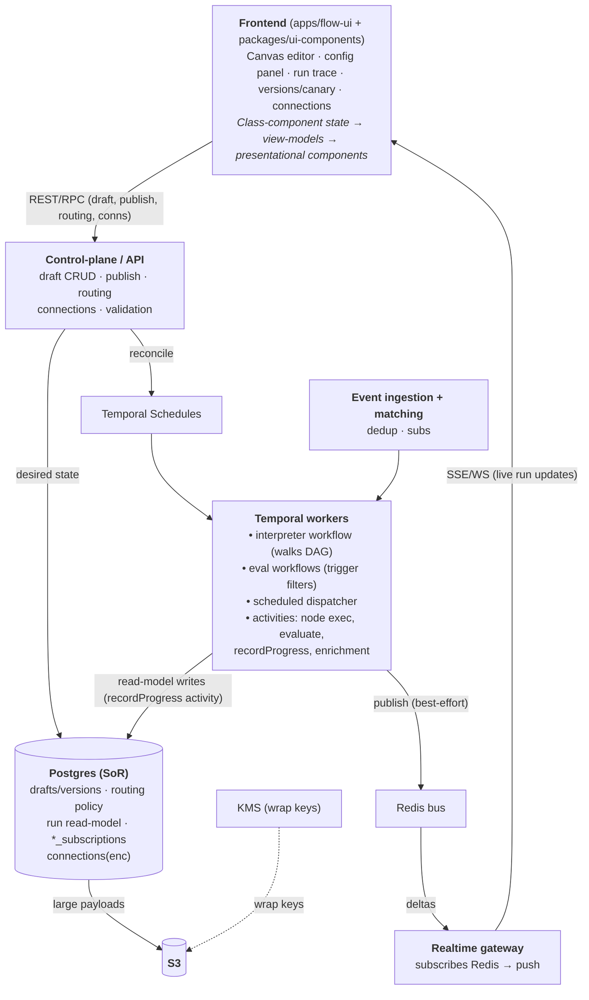
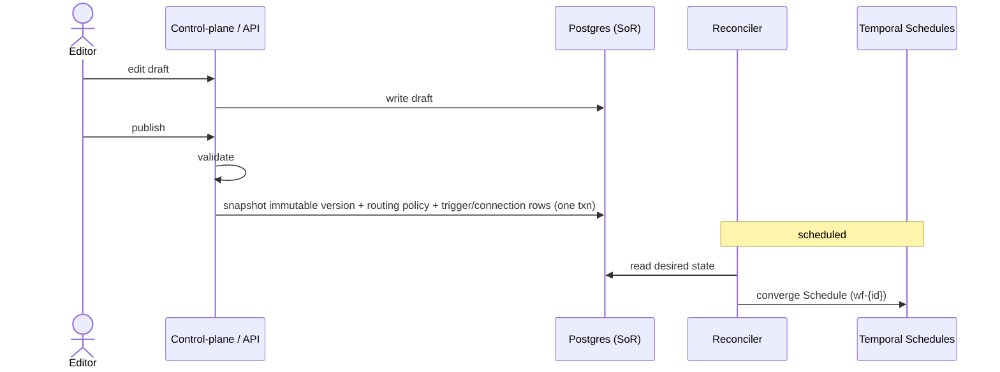
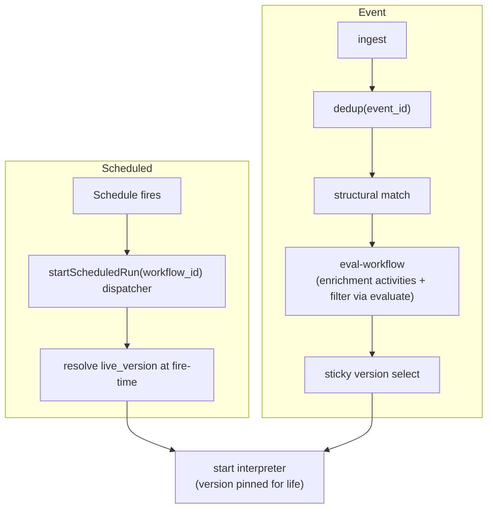
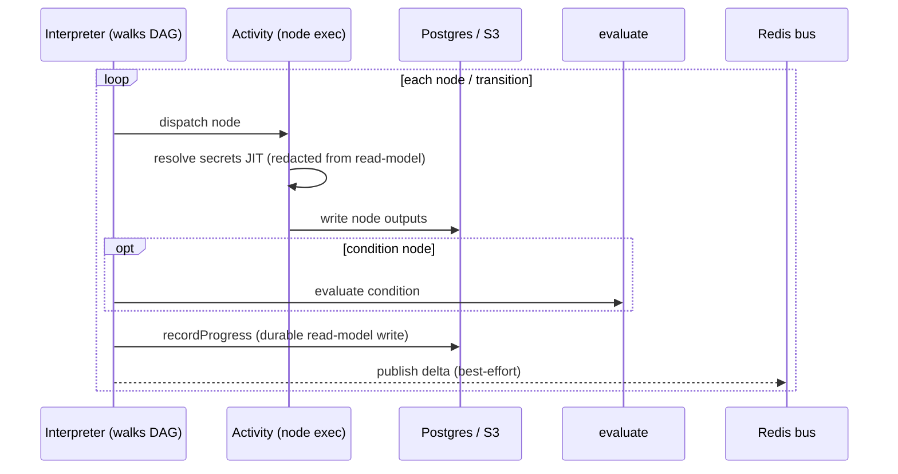
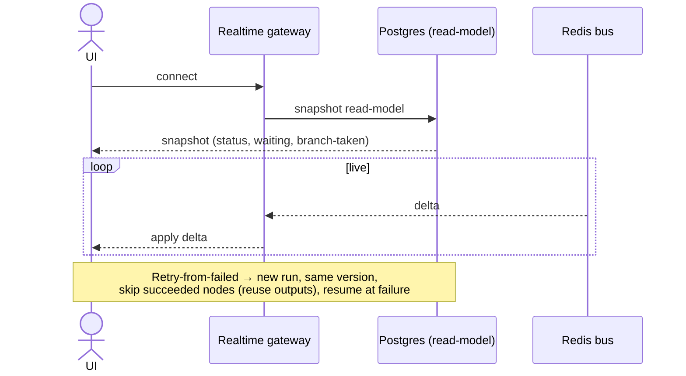
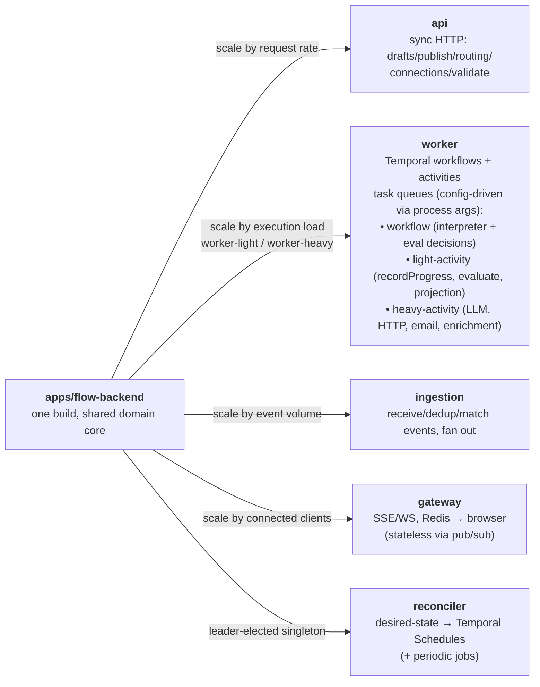

# FM Flow — High-Level Design (overview)

A visual workflow-builder: users assemble branching workflows on a canvas, run them durably on Temporal, and observe/debug executions. This stitches together the decisions in [`../adr/`](../adr/README.md); the storage layer is detailed in [`data-model.md`](data-model.md). Status: design draft, 2026-06-16.

## Components

## The load-bearing decisions, by domain

| Domain | Decision | ADR |
|---|---|---|
| Execution | Generic **interpreter** walks a pinned, immutable definition as data on Temporal | 0001 |
| State | **Temporal = orchestration, Postgres = system of record, S3 = blobs**; storage lane static per step type | 0002 |
| Conditions | Evaluated in an **`evaluate` activity** (no dual state); replay-safe via immutability + Temporal caching | 0003 |
| Reporting | **Postgres read-model** via idempotent `recordProgress`; **Redis bus** → SSE/WS; snapshot+deltas | 0004 |
| Failure | **Fail-fast**, binary status; **retry-from-failed** seeded from the read-model (same version) | 0005 |
| Triggers | Unified ingestion/matching; **desired-state reconciler**; durable **eval-workflow** for I/O filters | 0006 |
| Versioning | **Routing policy** `{live, canary?, weight, sticky_key}`; **sticky-by-key** canary, monotonic ramp | 0007 |
| Secrets | **Connections by id**, resolved JIT in activities, redacted everywhere; **KMS-envelope in Postgres** | 0008 |
| Node types | **Built-in catalog**; node type = **manifest + executor**; manifests served to UI; schema capped to latest; `retrySafe` | 0009 |
| Dynamic outputs | `output_spec` = static or **`from_config`** (config-derived outputs, e.g. document extractor); per-instance refs; broken refs block publish | 0014 |
| Expressions | **CEL substrate + structured-builder UI**; type-checked vs declared outputs; CEL canonical; `{{ <CEL> }}` interpolation | 0010 |
| Auth/tenancy | **Cognito = identity only**; memberships+roles in Postgres; **pool + RLS**; `org_id` into Temporal run context | 0011 |
| Persistence | **Hybrid graph** (JSONB + derived index); **event-sourced** read-model (`run_events` → projections); time-partitioned + tiered retention | 0012 |
| Reliability | **Effectively-once** 3-lever stack (deterministic `workflow_id`+dedup, read-model `seq`, `retrySafe`+idempotency keys); run timeout + `dead_letter_events` | 0013 |
| Topology | **Modular monolith** `apps/flow-backend`; role entrypoints (api/worker/ingestion/gateway/reconciler); worker task-queues split by workload class | 0015 |
| Stack | **Python + FastAPI**; `cel-python`; **SSE self-hosted gateway**; `temporalio`/SQLAlchemy/redis-py; OpenAPI → typed TS client | 0016 |

## Key flows

**1. Author → publish.** Editor → API writes draft to Postgres. Publish validates, snapshots an immutable version, updates the routing policy, and (scheduled) the reconciler converges a Temporal Schedule (`wf-{id}`). Trigger/connection rows are written in the same transaction.

**2. Trigger → run start (version pinned for life).**
- *Scheduled:* Schedule → `startScheduledRun(workflow_id)` dispatcher → resolves `live_version` at fire-time → starts interpreter.
- *Event:* ingest → dedup(`event_id`) → structural match → **eval-workflow** (enrichment activities + filter via `evaluate`) → **sticky version select** → starts interpreter.

**3. Execute.** The interpreter walks the DAG, dispatches each node as an activity; node outputs land in Postgres/S3; conditions call `evaluate`; every transition calls **`recordProgress`** (durable read-model write + best-effort Redis publish). Secrets resolve JIT inside activities, redacted from the read-model.

**4. Observe / recover.** UI snapshots the read-model on connect, then applies Redis deltas live. "Waiting" status and branch-taken are read-model columns. **Retry-from-failed** starts a new run on the same version, skipping succeeded nodes (reusing stored outputs), resuming at the failure.

## Deployment topology (ADR-0015)

One build — **`apps/flow-backend`** (shared domain core) — launched as five independently-deployable role entrypoints:

`apps/flow-ui` (Next.js) is the separate frontend. Microservices are deferred — carve a role into its own service only when load demands.

## v1 scope

Ship a **linear + binary-condition** vocabulary (concrete steps + condition + filter + timed delay + schedule/event/webhook triggers + canary). **Defer** Parallel / Join / Map / in-graph event-Wait → so v1 runs a **single interpreter workflow** (no child workflows), and `wait_subscriptions` / sub-run drill-down are deferred. The general design accommodates these later without rework.

## Open / deferred (parking lot)

- Persistence schema consolidation / backend service topology.
- Reliability / idempotency hardening; scaling / tenant isolation.
- Concurrency vocabulary (Parallel/Join/Map), in-graph event-Wait correlation.
- Wait-vs-trigger fine details (exclusive-consume, dedup scope), pure/IO filter split optimization.
